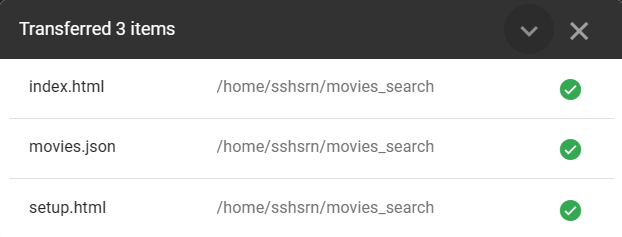
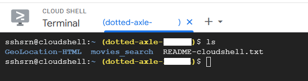
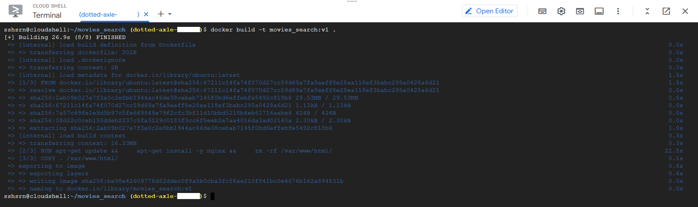
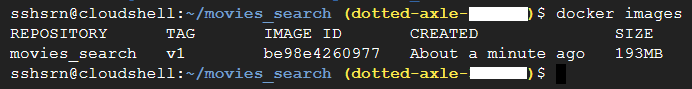
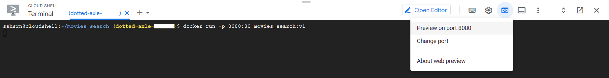
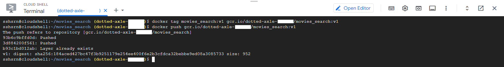
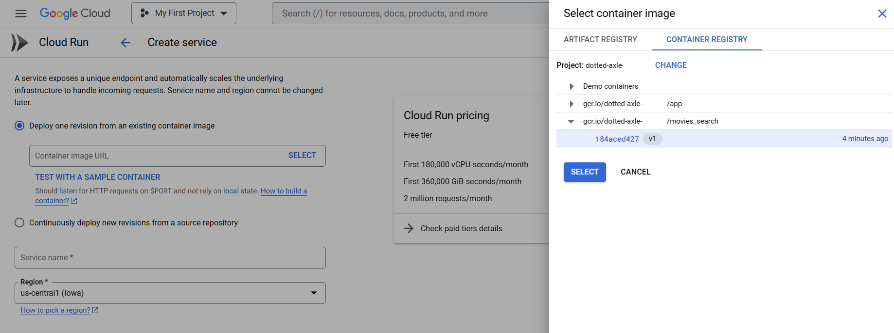
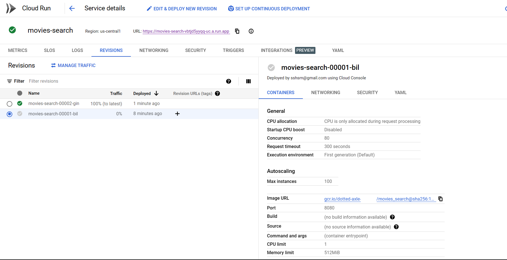
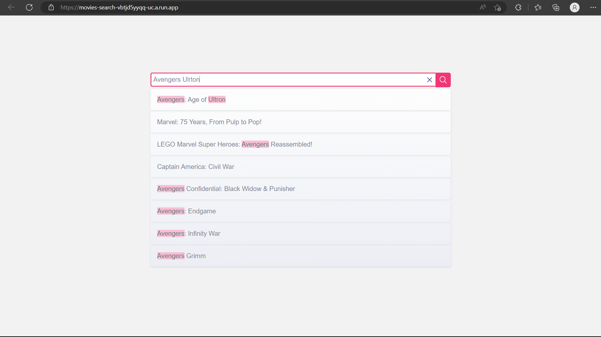

## Deploying a project with Cloud Run

### In this article, we will learn how to deploy a simple HTML project on the cloud run.

Cloud Run - Cloud Run is a serverless compute platform offered by Google Cloud Platform (GCP). It allows you to run containerized applications without worrying about managing the underlying infrastructure. 

* First, upload the project to the google cloud by clicking on the upload button in the drop down menu of the cloud shell.

* Then, click on upload folder and select the project folder from your local machine.<br>

* Once uploaded, confirm the same by using the ls command in the cloud shell.<br>


* Now, we need to create a docker image of the project. For this, we need to create a Dockerfile in the project folder. The Dockerfile should contain the following code:
```Dockerfile
FROM ubuntu:latest

# Update and install Nginx
RUN apt-get update && \
    apt-get install -y nginx && \
    rm -rf /var/www/html/

# Copy Nginx configuration file
COPY . /var/www/html/

# Expose port 80
EXPOSE 80

# Start Nginx
CMD ["nginx", "-g", "daemon off;"]
```
* Now, to build the docker image, run the following commands in the cloud shell:
```bash
docker build -t movies_search:v1 .
```
In the above command, movies_search is the name of the project and v1 is the version of the project. The '.' at the end of the command is the path of the Dockerfile, which is the current directory.

* Now, to check if the docker image is created, run the following command:
```bash
docker images
```

* Now, to run the docker image, run the following command:
```bash
docker run -p 8080:80 movies_search:v1
```
In the above command, -p is used to map the port 8080 of the local machine to the port 80 of the docker container. movies_search is the name of the project and v1 is the version of the project.
The above command will run the docker image in the port 8080 of the google cloud shell. To access the project, go to the web preview option in the drop down menu of the cloud shell and click on the port 8080.

* Now, the project is running in the cloud shell, but to make it available to the public, we need to deploy it on the cloud run. For this, first we should push the docker image to the google cloud container registry. 
Google Cloud Container Registry: Google Cloud Container Registry is a managed, private container image registry provided by Google Cloud Platform (GCP). It allows you to store, manage, and deploy your container images securely. 
For this, run the following commands:
```bash
docker tag movies_search:v1 gcr.io/PROJECT_ID/movies_search:v1
docker push gcr.io/PROJECT_ID/movies_search:v1
```
In the above commands, gcr.io/PROJECT_ID is the path of the google cloud container registry. PROJECT_ID is the id of the project. movies_search is the name of the project and v1 is the version of the project.

* Now, to deploy the project on the cloud run, search for cloud run in the search bar of the google cloud console and click on the cloud run option. Then, click on "Create Service" button. In the next page, select the image from the google cloud container registry, which we have pushed in the previous step.
In the "Authentication" section, select "Allow unauthenticated invocations" as we want to make the project available to the public. Then, make the other necessary changes and click on the "Create" button.


* Now, the project is deployed on the cloud run!🥳


* You can check out my deployed project [here](https://movies-search-vbtjd5yyqq-uc.a.run.app/).
* The above steps are the basic steps to deploy a project on the cloud run. For more information, you can refer to the [official documentation](https://cloud.google.com/run/docs/quickstarts/build-and-deploy).
