## Deploying a project with Cloud Run

### In this article, we will learn how to containerize a project containing a separate frontend and backend using Docker, deploy it on the cloud run and also set up the CI/CD pipeline using GitHub Actions.

* First, upload the project to the google cloud by clicking on the upload button in the drop down menu of the cloud shell.
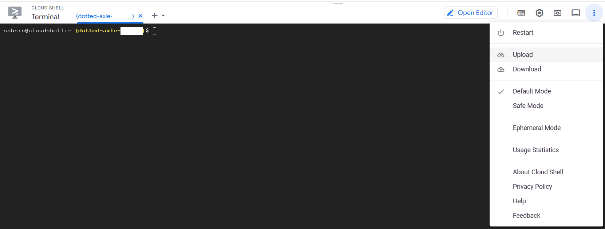
* Then, click on upload folder and select the project folder from your local machine.<br>
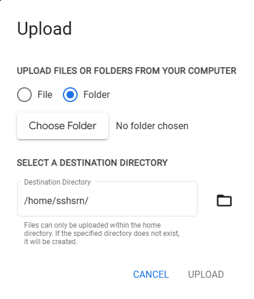
* Once uploaded, confirm the same by using the ls command in the cloud shell.<br>
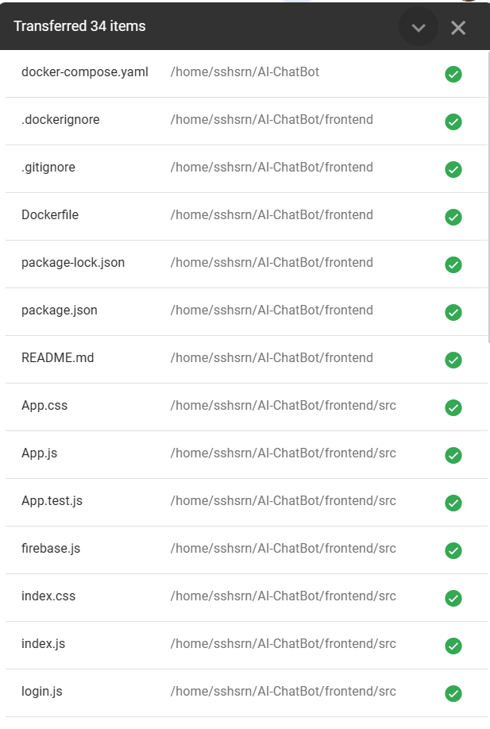
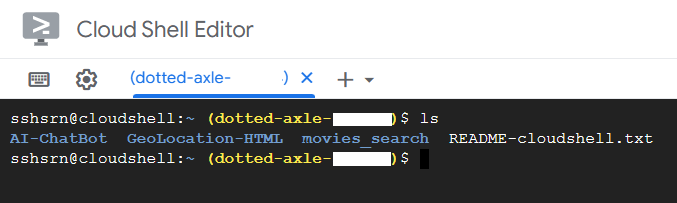
* Now, we need to create a docker image of the project. But in our case, we have a separate frontend and backend. So, we need to create two docker images, one for the frontend and one for the backend. For this, we need to create two Dockerfiles, each for the frontend and backend in the respective folders and there should be a `docker-compose.yaml` file in the root directory of the project to run both the docker images simultaneously. In our case, the docker-compose.yaml file contains the following code:
```yaml
# This file is used to define multiple containers that work together as part of this application

services:
  backend:
    build: 
      context: ./backend
    container_name: backend
    ports:
      - "3000:3000"
  frontend:
    build:
      context: ./frontend
    container_name: frontend
    ports:
      - "3001:3000"
    depends_on:
      - backend
```
* Now, to create the docker image for the frontend, create a Dockerfile in the frontend folder. As the frontend is a React application, the Dockerfile contains the following code:
```Dockerfile
# Fetching the latest node image on alpine linux
FROM node:14.17.5-alpine

# Declaring env
ENV NODE_ENV development

# Setting up the work directory (a new directory will be created)
WORKDIR /app

# Installing dependencies
COPY ./package.json /app
RUN npm install

# Copying all the files in our project
COPY . .

# Make port 3000 available to the world outside this container
EXPOSE 3000

# Starting our application
CMD npm start
```
* Now, to create the docker image for the backend, create a Dockerfile in the backend folder. As the backend is a Node.js application, the Dockerfile contains the following code:
```Dockerfile
# Fetching the latest node image on alpine linux
FROM node:alpine AS development

# Declaring env
ENV NODE_ENV development

# Setting up the work directory (a new directory will be created)
WORKDIR /app

# Installing dependencies
COPY ./package.json /app
RUN npm install --silent

# Copying all the files in our project
COPY . .

# Make port 3001 available to the world outside this container
EXPOSE 3001

# Starting our application
CMD node index.js
```
* Now, to build the docker image for both the frontend and backend, run the following command:
```bash
docker-compose build
```
On executing the above command, the docker images for both the frontend and backend will be created.
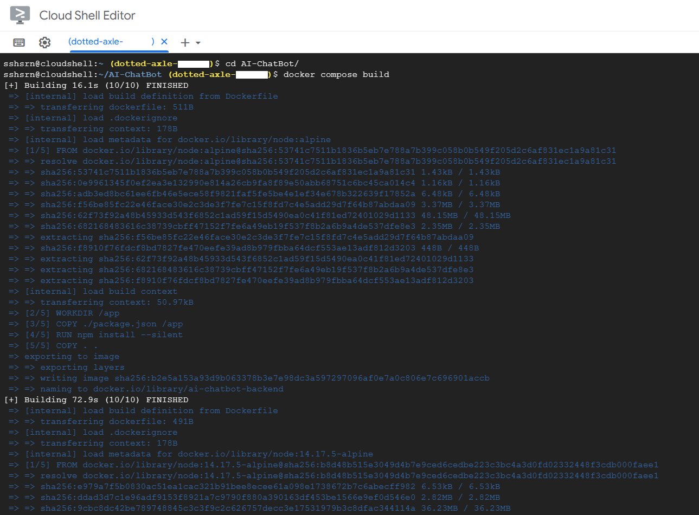
* Now, to check if the docker image is created, run the following command:
```bash
docker images
```
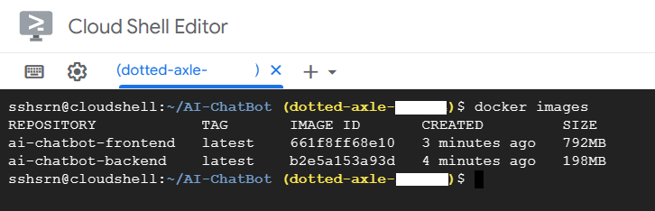
* Now, we need to deploy it on the cloud run to make the project available to the public. For this, first we should push the docker image to the google cloud container registry. For this, run the following commands:
```bash
docker tag ai-chatbot-frontend:latest gcr.io/PROJECT_ID/ai-chatbot-frontend:v1
docker push gcr.io/PROJECT_ID/ai-chatbot-frontend:v1
docker tag ai-chatbot-backend:latest gcr.io/PROJECT_ID/ai-chatbot-backend:v1
docker push gcr.io/PROJECT_ID/ai-chatbot-backend:v1
```
In the above commands, gcr.io/PROJECT_ID is the path of the google cloud container registry. PROJECT_ID is the id of the project. ai-chatbot-frontend and ai-chatbot-backend are the names of the docker images. v1 is the tag of the docker image. Tag names are just for the referenc and can be anything.
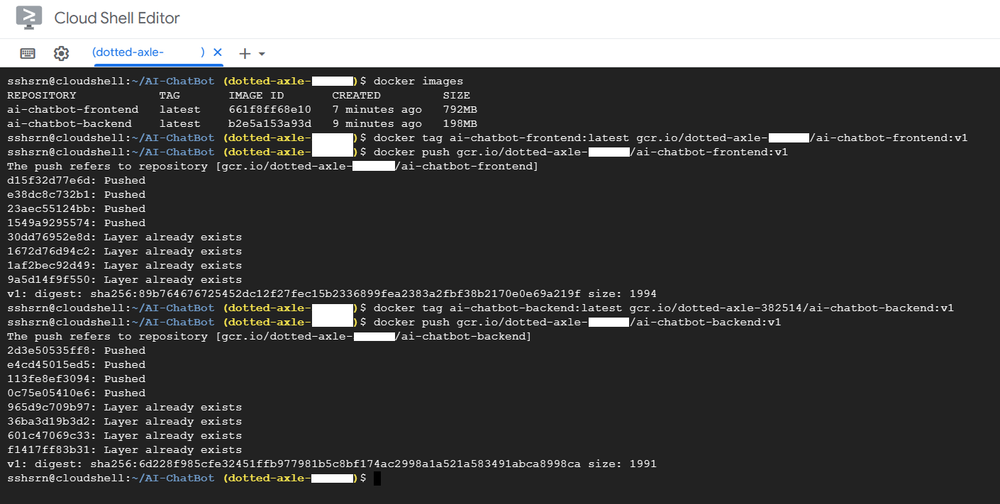
* Now, to deploy the project on the cloud run, search for cloud run in the search bar of the google cloud console and click on the cloud run option. Then, click on "Create Service" button. In the next page, select the image from the google cloud container registry, which we have pushed in the previous step.
In the "Authentication" section, select "Allow unauthenticated invocations" as we want to make the project available to the public. Then, make the other necessary changes and click on the "Create" button.
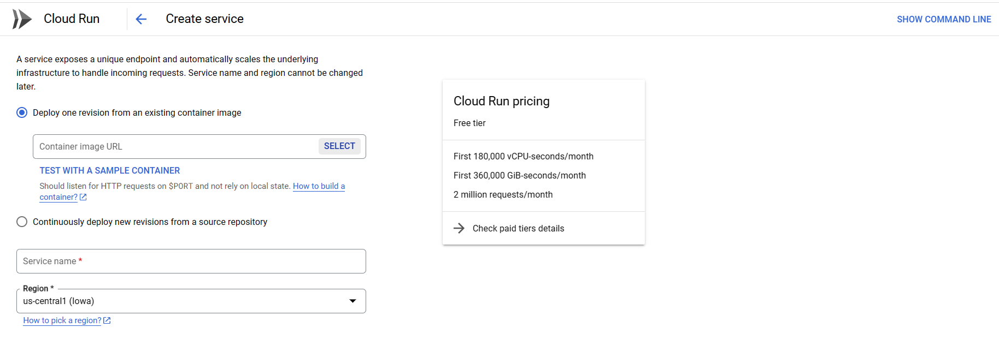
* Now, the project is deployed on the cloud run!🥳
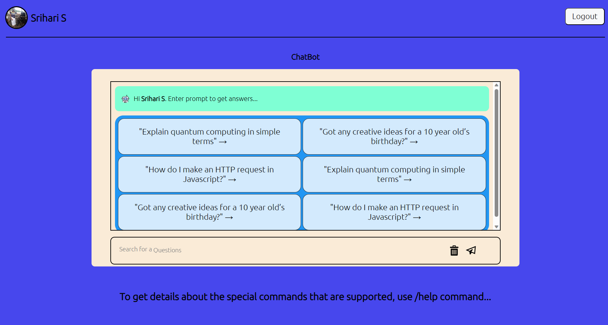
* To set up the CI/CD pipeline, click on the `Set Up Continuous Deployment` button in the cloud run page. Then, select the GitHub option and click on the `Continue` button.
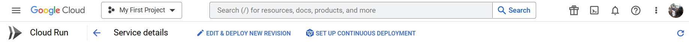
* In the next page, select the repository from which you want to deploy the project. Then, click on the `Next` button.
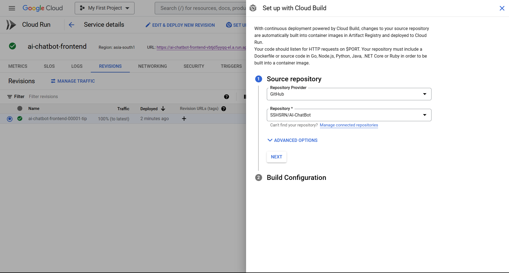
* In the `Build Configuration` section, select the branch from which you want to deploy the project and also select the `Dockerfile` option for `Build Type` and specify the path to the `Dockerfile`. Then, click on the `Save` button.
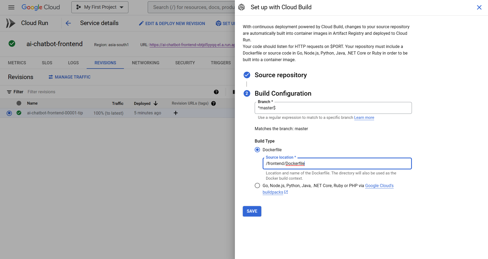
* Now, the CI/CD pipeline is set up and the project will be deployed automatically whenever a new commit is pushed to the selected branch in GitHub!🥳
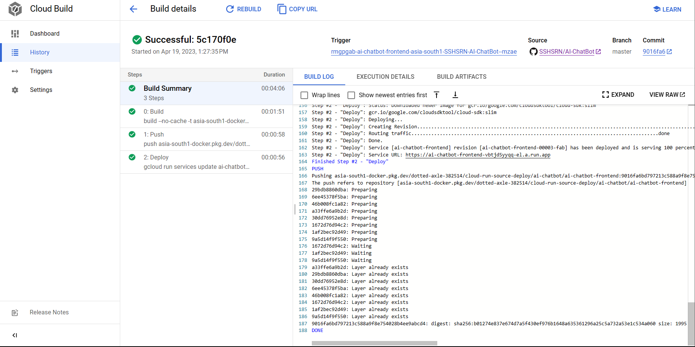
* You can check out my deployed project [here](https://ai-chatbot-frontend-vbtjd5yyqq-el.a.run.app/).
* The above steps are the basic steps to deploy a project on the cloud run. For more information, you can refer to the [official documentation](https://cloud.google.com/run/docs/quickstarts/build-and-deploy).